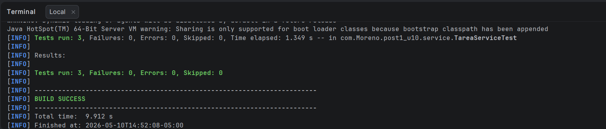
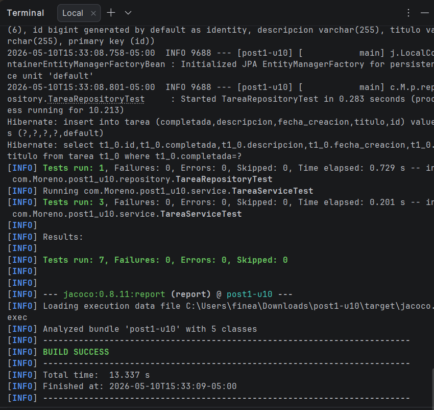
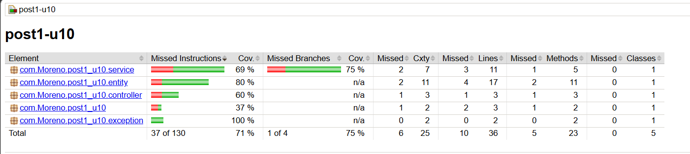

# Post-Contenido 1 — Suite de Pruebas con JUnit 5, Mockito y JaCoCo

**Programación Web — Unidad 10: Pruebas de Software en Aplicaciones Web**  
**Ingeniería de Sistemas — UDES 2026**

---

## Descripción

Aplicación Spring Boot de gestión de tareas con una suite completa de pruebas
automatizadas usando JUnit 5, Mockito y JaCoCo. Incluye pruebas unitarias,
pruebas de integración para la capa web y de repositorio, y verificación de
cobertura mínima del 70%.

---

## Requisitos

- Java 17+
- Maven 3.9.x (o usar el wrapper `mvnw` incluido)
- IntelliJ IDEA o VS Code con Extension Pack for Java

---

## Estructura del Proyecto
```plaintext
src/
├── main/java/com/Moreno/post1_u10/
│   ├── controller/
│   │   └── TareaController.java
│   ├── entity/
│   │   └── Tarea.java
│   ├── exception/
│   │   └── GlobalExceptionHandler.java
│   ├── repository/
│   │   └── TareaRepository.java
│   └── service/
│       └── TareaService.java
└── test/java/com/Moreno/post1_u10/
├── controller/
│   └── TareaControllerTest.java
├── repository/
│   └── TareaRepositoryTest.java
└── service/
└── TareaServiceTest.java
```

---

## Cómo ejecutar los tests
```bash
# Con el wrapper incluido (no requiere Maven instalado)
.\mvnw test

# Si tienes Maven instalado globalmente
mvn test
```

---

## Cómo ver el reporte de cobertura JaCoCo

Después de ejecutar los tests, abre en tu navegador:
```plaintext
target/site/jacoco/index.html
```

---

## Clases de Prueba

### TareaServiceTest — Pruebas unitarias con Mockito
Ubicación: `src/test/.../service/TareaServiceTest.java`  
Usa `@ExtendWith(MockitoExtension.class)`, `@Mock` e `@InjectMocks`.

| Test | Qué verifica |
|------|-------------|
| `crear_conTituloValido_guardaYRetorna` | Que el servicio guarda y retorna la tarea cuando el título es válido |
| `crear_conTituloVacio_lanzaIllegalArgumentException` | Que se lanza excepción y el repositorio nunca es invocado |
| `buscarPorId_noExiste_lanzaEntityNotFoundException` | Que se lanza excepción cuando el ID no existe |

### TareaControllerTest — Pruebas de capa web con @WebMvcTest
Ubicación: `src/test/.../controller/TareaControllerTest.java`  
Usa `@WebMvcTest`, `MockMvc` y `@MockBean`.

| Test | Qué verifica |
|------|-------------|
| `get_tareaExiste_retorna200` | Que el endpoint GET retorna 200 y el JSON correcto |
| `get_noExiste_retorna404` | Que el endpoint GET retorna 404 cuando la tarea no existe |

### TareaRepositoryTest — Pruebas de repositorio con @DataJpaTest
Ubicación: `src/test/.../repository/TareaRepositoryTest.java`  
Usa `@DataJpaTest` con H2 en memoria y `TestEntityManager`.

| Test | Qué verifica |
|------|-------------|
| `findByCompletada_false_retornaUnaTarea` | Que el método personalizado filtra correctamente por estado |

---

## Tecnologías usadas

| Tecnología | Versión | Uso |
|-----------|---------|-----|
| Spring Boot | 3.2.5 | Framework base |
| JUnit 5 | Incluido en starter-test | Pruebas unitarias |
| Mockito | Incluido en starter-test | Mocks y stubs |
| MockMvc | Incluido en starter-test | Pruebas de controladores |
| H2 Database | Runtime | Base de datos en memoria para tests |
| JaCoCo | 0.8.11 | Cobertura de código |

---

## Evidencia de Cobertura

- Test TareaService


- Test TareaService, TareaController y TareaRepository


- Jacoco reporte

